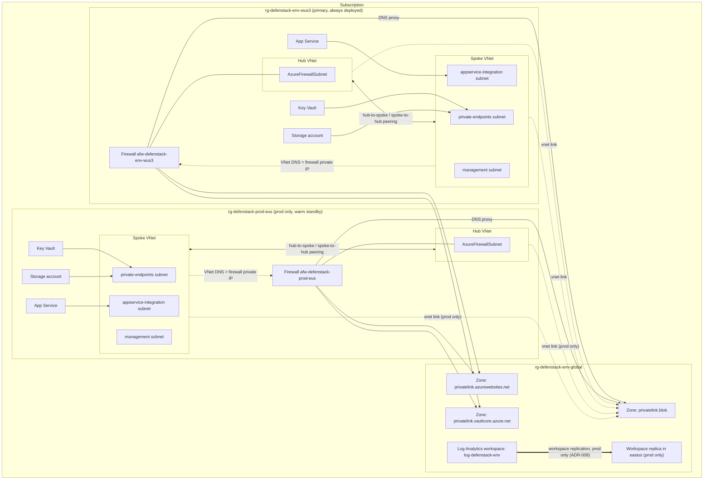
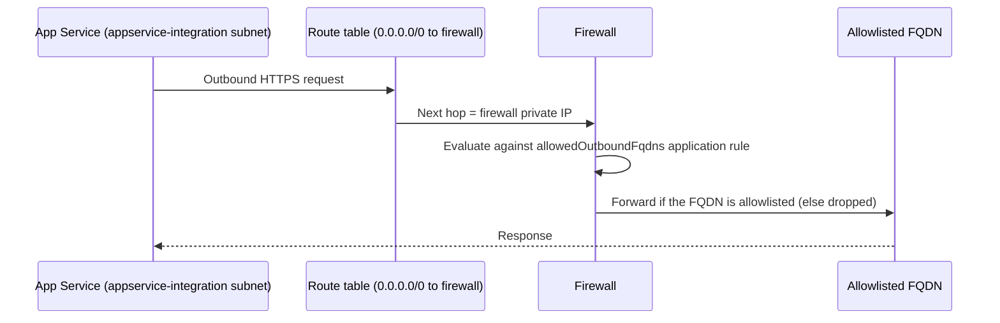
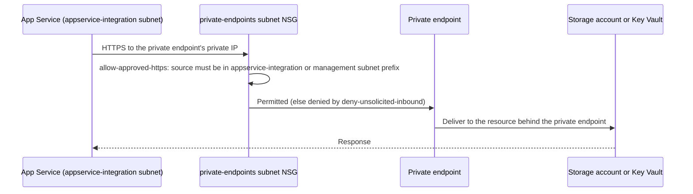
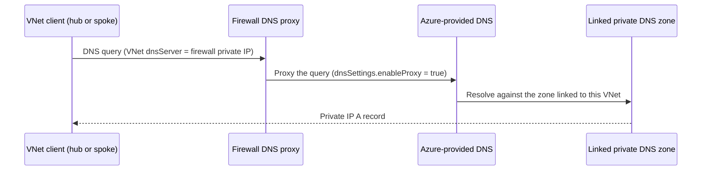

# Architecture overview: Phase 1 (subscription-scope, multi-region)

> Owning files: `main.bicep`, `modules/global.bicep`, `modules/regionStamp.bicep`, `modules/privateDnsZoneLinks.bicep`, `modules/types.bicep`. Spec: `docs/superpowers/specs/2026-09-25-secure-connectivity-design.md` §1.

## 1. Purpose and status

Phase 1 replaces the single resource-group, resource-group-scoped `defenStack` deployment with a **subscription-scope** deployment (`targetScope = 'subscription'` in `main.bicep`) that fans out, with `resourceGroup(name)`, to resource groups the operator pre-creates (runbook 01). One deployment now spans:

- A **global layer** (`modules/global.bicep`), deployed once per environment into `rg-defenstack-<env>-global`: the shared Log Analytics workspace and the three `privatelink.*` private DNS zones every region stamp uses.
- One or two **region stamps** (`modules/regionStamp.bicep`), each a hub/spoke pair with Azure Firewall, private App Service, Key Vault and Storage, deployed into `rg-defenstack-<env>-<regionCode>`:
  - The **primary** stamp is always deployed (West US 3 for both dev and prod).
  - The **secondary** stamp is deployed only when `deploySecondaryRegion = true` (prod only, East US). Dev runs primary-only (`ADR-008`).
- Shared-zone **VNet links** (`modules/privateDnsZoneLinks.bicep`), one deployment per zone, linking every deployed stamp's hub and spoke VNets so both firewall DNS-proxy resolution and private-endpoint record lookups work from every region.

What exists after Phase 1: zone-redundant Azure Firewall Standard and App Service (prod primary only) per region, private endpoints for Storage/App Service/Key Vault, deny-by-default NSGs, hub↔spoke peering, and Log Analytics workspace replication from the primary region to the secondary (prod only).

What later phases add (not present after Phase 1):

| Phase | Adds |
|---|---|
| 2 | Azure Firewall **Premium** and a parent firewall policy |
| 3 | Azure Bastion, Point-to-Site VPN, and the `deployAdminAccess` flag; a `GatewaySubnet` route table |
| 4 | Azure Front Door Premium + WAF (public ingress) |
| 5 | RA-GZRS storage, Application Insights |
| 6 | Azure Monitor Private Link Scope (AMPLS), alerts, Microsoft Sentinel |
| 7 | Microsoft Defender for Cloud plans, Azure Policy assignments |
| 8 | Recovery Services vaults, hub-to-hub peering, the regional-failover runbook |

## 2. Topology

Notes on the diagram:
- Every zone (`ZBLOB`, `ZSITES`, `ZVAULT`) is linked to every deployed stamp's hub **and** spoke VNet, one link per VNet named `<vnet>-link` (`modules/privateDnsZoneLinks.bicep`). Only the blob zone's links are drawn above to keep the diagram legible; the sites and vault zones follow the identical pattern.
- The East US subgraph (`EUS`) and its links exist only when `deploySecondaryRegion = true` (prod).
- `WSREPLICA` is not a second workspace resource — it is the same `log-defenstack-<env>` workspace's replica location, set via `replication.location` (`modules/monitoring.bicep`).

## 3. Traffic flows

### Egress: application outbound HTTPS

An empty `allowedOutboundFqdns` (the shipped default in both `params/dev.bicepparam` and `params/prod.bicepparam`) denies all application egress until an operator adds FQDNs.

### Private endpoint access: App Service to Storage / Key Vault

`approvedPrivateEndpointSourceCidrs` (`modules/regionStamp.bicep`) is derived from `addressPlan.appServiceIntegrationSubnetPrefix` and `addressPlan.managementSubnetPrefix`, plus any `additionalPrivateEndpointSourceCidrs` the caller supplies — no other source reaches the private endpoint subnet.

### DNS resolution: client to a private zone record

### Ingress

None yet. There is no public entry point in Phase 1 — App Service, Key Vault and Storage all have public network access disabled and only private endpoints reach them. The app remains private-only until Phase 4 adds Azure Front Door Premium with WAF.

## 4. Address plan

Copied from the design spec's Global Constraints (`docs/superpowers/specs/2026-09-25-secure-connectivity-design.md` §1) and the shipped parameter files.

| Env | Region | Hub address space | Firewall subnet | Spoke address space | `private-endpoints` | `appservice-integration` | `management` | Reserved (not yet allocated) |
|---|---|---|---|---|---|---|---|---|
| dev | westus3 (primary only) | `10.21.0.0/16` | `10.21.0.0/26` | `10.20.0.0/16` | `10.20.1.0/24` | `10.20.2.0/24` | `10.20.3.0/24` | `AzureBastionSubnet` /26, `GatewaySubnet` /27 (Phase 3; dev has no admin-access path) |
| prod | westus3 (primary) | `10.1.0.0/16` | `10.1.0.0/26` | `10.0.0.0/16` | `10.0.1.0/24` | `10.0.2.0/24` | `10.0.3.0/24` | `AzureBastionSubnet` /26, `GatewaySubnet` /27 in the hub; P2S VPN client pool `172.16.200.0/24` (outside the VNet) |
| prod | eastus (secondary, warm standby) | `10.11.0.0/16` | `10.11.0.0/26` | `10.10.0.0/16` | `10.10.1.0/24` | `10.10.2.0/24` | `10.10.3.0/24` | `AzureBastionSubnet` /26, `GatewaySubnet` /27 (deployed only during failover, per ADR-008) |

Every stamp's three spoke subnet prefixes come from `regionAddressPlan` (`modules/types.bicep`) and are supplied per region by `primaryAddressPlan` / `secondaryAddressPlan` in `main.bicep`; nothing is hard-coded in a module.

## 5. Naming convention

One row per `names.*` key in `modules/regionStamp.bicep`, plus the resource group, workspace and zone names from `main.bicep` / `modules/global.bicep`. Example values use dev, West US 3 (`environmentName = dev`, `regionCode = wus3`). `<hash>` stands for `uniqueString(subscription().id, environmentName, location)` (a deterministic 13-character string; the exact value depends on the subscription ID and is illustrative only below).

| Name | Pattern | Example (dev, wus3) |
|---|---|---|
| Global resource group | `rg-defenstack-<env>-global` | `rg-defenstack-dev-global` |
| Region resource group | `rg-defenstack-<env>-<regionCode>` | `rg-defenstack-dev-wus3` |
| Log Analytics workspace | `log-defenstack-<env>` | `log-defenstack-dev` |
| Private DNS zone (blob) | `privatelink.blob.<storage suffix>` | `privatelink.blob.core.windows.net` |
| Private DNS zone (sites) | `privatelink.azurewebsites.net` | `privatelink.azurewebsites.net` |
| Private DNS zone (vault) | `privatelink.vaultcore.azure.net` | `privatelink.vaultcore.azure.net` |
| `names.hubVnet` | `vnet-defenstack-<env>-<regionCode>-hub` | `vnet-defenstack-dev-wus3-hub` |
| `names.spokeVnet` | `vnet-defenstack-<env>-<regionCode>-spoke` | `vnet-defenstack-dev-wus3-spoke` |
| `names.firewall` | `afw-defenstack-<env>-<regionCode>` | `afw-defenstack-dev-wus3` |
| `names.firewallPolicy` | `afwp-defenstack-<env>-<regionCode>` | `afwp-defenstack-dev-wus3` |
| `names.firewallPublicIp` | `pip-afw-defenstack-<env>-<regionCode>` | `pip-afw-defenstack-dev-wus3` |
| `names.storageAccount` | `st<regionCode><hash>` | `stwus3<hash>` |
| `names.keyVault` | `kv-<regionCode>-<hash>` | `kv-wus3-<hash>` |
| `names.appServicePlan` | `asp-defenstack-<env>-<regionCode>` | `asp-defenstack-dev-wus3` |
| `names.appService` | `app-defenstack-<env>-<regionCode>-<hash, first 6>` | `app-defenstack-dev-wus3-<hash6>` |
| `names.virtualMachine` | `vm<regionCode><hash, first 7>` | `vmwus3<hash7>` |

## 6. Resource inventory per resource group

### dev

| Resource group | Contents |
|---|---|
| `rg-defenstack-dev-global` | Log Analytics workspace `log-defenstack-dev` (`replication.enabled: false`); private DNS zones `privatelink.blob...`, `privatelink.azurewebsites.net`, `privatelink.vaultcore.azure.net`, each with 2 VNet links (dev-wus3 hub and spoke) |
| `rg-defenstack-dev-wus3` | Hub VNet with `AzureFirewallSubnet`; Firewall Standard `afw-defenstack-dev-wus3` (zones 1/2/3, `threatIntelMode: Alert`, `ADR-003`); firewall policy and public IP; spoke VNet with `private-endpoints`, `appservice-integration`, `management` subnets, their NSGs, and two route tables (App Service and management egress through the firewall); App Service Plan `asp-defenstack-dev-wus3` (S1-equivalent, 1 instance, non-zonal); App Service with system-assigned identity and private endpoint; Key Vault (RBAC, purge protection on, 90-day soft delete) with private endpoint; Storage account (`Standard_LRS`) with private endpoint; hub↔spoke peering |

### prod

| Resource group | Contents |
|---|---|
| `rg-defenstack-prod-global` | Log Analytics workspace `log-defenstack-prod` (`replication.enabled: true, location: eastus`); the same three private DNS zones, each with 4 VNet links (wus3 hub, wus3 spoke, eus hub, eus spoke) |
| `rg-defenstack-prod-wus3` (primary) | Same shape as dev's region resource group, but: Firewall `threatIntelMode: Deny`; App Service Plan `asp-defenstack-prod-wus3` zone-redundant, 3 instances (`isProd && isPrimary`); Storage account `Standard_GRS`; `enableDeleteLock: true` on the spoke VNet and the global zones/workspace |
| `rg-defenstack-prod-eus` (secondary, warm standby) | Same resource types as `rg-defenstack-prod-wus3`, deployed only when `deploySecondaryRegion = true`: App Service Plan `asp-defenstack-prod-eus`, 1 instance, non-zonal (no scale-out until failover, `ADR-008`); Storage account `Standard_GRS`; hub↔spoke peering local to this region |

## 7. Design decisions

- [ADR-003: Dev firewall threat intelligence stays in Alert mode](../decisions/ADR-003-dev-threat-intel-alert-mode.md)
- [ADR-004: NSGs keep an explicit deny-all inbound rule](../decisions/ADR-004-nsg-default-deny-inbound.md)
- [ADR-005: Spoke VNet uses a single DNS server, the firewall's DNS proxy IP](../decisions/ADR-005-single-firewall-dns-proxy.md)
- [ADR-006: App Service health probe path stays at the default until application code lands](../decisions/ADR-006-appservice-health-probe-path.md)
- [ADR-007: Dev environment pipeline exposure accepted for Phase 0](../decisions/ADR-007-dev-environment-pipeline-exposure.md)
- [ADR-008: Warm standby in East US, dev stays single-region](../decisions/ADR-008-warm-standby-and-dev-single-region.md)
- [ADR-009: Subscription-scope pipeline and hardened deployment identity](../decisions/ADR-009-subscription-scope-pipeline-identity.md)
