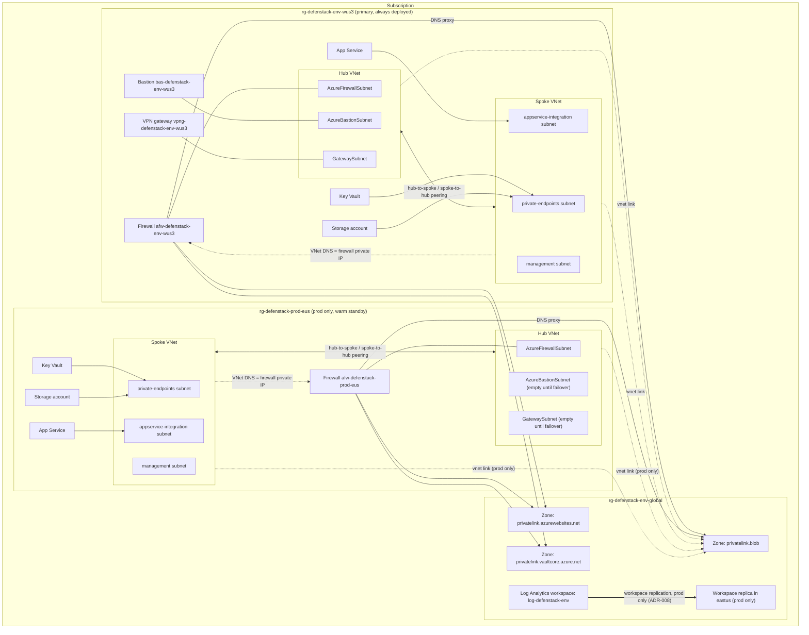
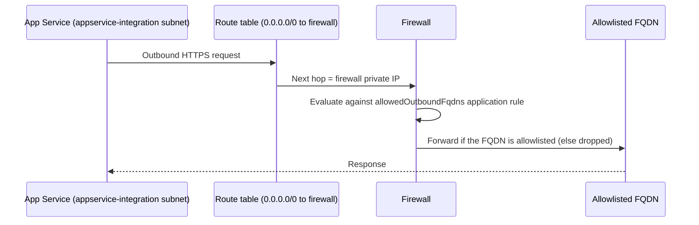
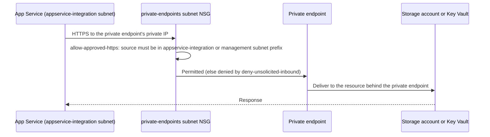
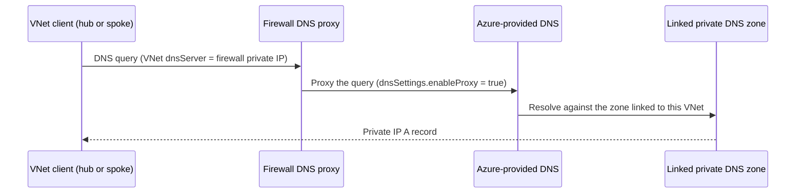
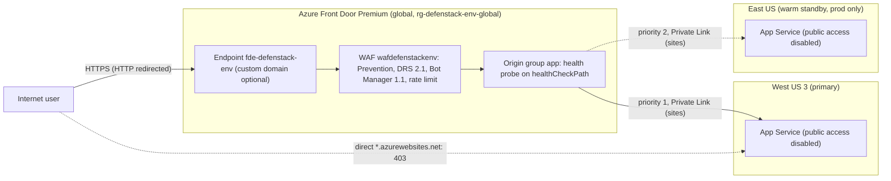
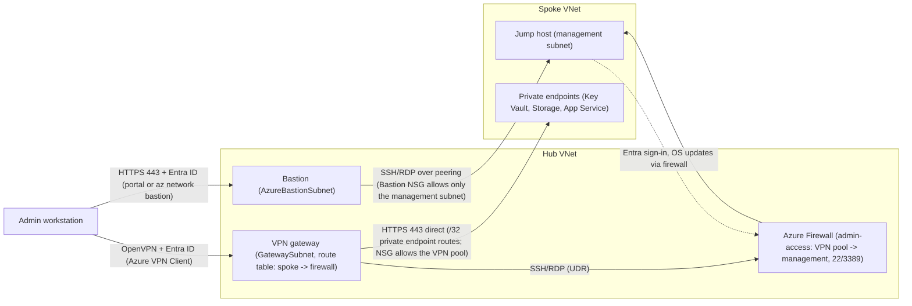

# Architecture overview: Phase 1-4 (subscription-scope, multi-region, Premium firewall, admin access, public ingress)

> Owning files: `main.bicep`, `modules/global.bicep`, `modules/regionStamp.bicep`, `modules/privateDnsZoneLinks.bicep`, `modules/types.bicep`, `modules/azureFirewall.bicep`, `modules/firewallPolicyRules.bicep`, `modules/hubNetwork.bicep`, `modules/bastion.bicep`, `modules/vpnGateway.bicep`, `modules/frontDoor.bicep`. Spec: `docs/superpowers/specs/2026-09-25-secure-connectivity-design.md` §1, §3, §5.

## 1. Purpose and status

Phase 1 replaces the single resource-group, resource-group-scoped `defenStack` deployment with a **subscription-scope** deployment (`targetScope = 'subscription'` in `main.bicep`) that fans out, with `resourceGroup(name)`, to resource groups the operator pre-creates (runbook 01). One deployment now spans:

- A **global layer** (`modules/global.bicep`), deployed once per environment into `rg-defenstack-<env>-global`: the shared Log Analytics workspace and the three `privatelink.*` private DNS zones every region stamp uses.
- One or two **region stamps** (`modules/regionStamp.bicep`), each a hub/spoke pair with Azure Firewall, private App Service, Key Vault and Storage, deployed into `rg-defenstack-<env>-<regionCode>`:
  - The **primary** stamp is always deployed (West US 3 for both dev and prod).
  - The **secondary** stamp is deployed only when `deploySecondaryRegion = true` (prod only, East US). Dev runs primary-only (`ADR-008`).
- Shared-zone **VNet links** (`modules/privateDnsZoneLinks.bicep`), one deployment per zone, linking every deployed stamp's hub and spoke VNets so both firewall DNS-proxy resolution and private-endpoint record lookups work from every region.

What exists after Phase 1–2 (the current state of this branch): a
zone-redundant Azure Firewall **Premium** with IDPS (`Alert` in dev, `Deny`
in prod) and zone-redundant App Service (prod primary only) per region,
private endpoints for Storage/App Service/Key Vault, deny-by-default NSGs,
hub↔spoke peering, and Log Analytics workspace replication from the primary
region to the secondary (prod only).

**Phase 2** upgraded every stamp's firewall from Phase 1's Standard tier to
**Premium** with IDPS (`Alert` in dev, `Deny` in prod) and moved rule content
into a shared module (`modules/firewallPolicyRules.bicep`) instead of the
one-parent-policy design originally planned, since a parent and its child
policies must share a region (`ADR-010`). See §3 and §7 below, and
[runbook 02](../runbooks/02-firewall.md).

**Phase 3** added the admin path: Azure Bastion Standard and an active-active,
Entra ID-authenticated point-to-site VPN gateway per region, behind the
`deployPrimaryAdminAccess` / `deploySecondaryAdminAccess` flags (on in the
primary region, off in the East US warm standby). It also added a
`GatewaySubnet` route table that sends VPN traffic for the spoke through the
firewall, gateway transit on the hub-spoke peering, and hub DNS pointing at the
firewall DNS proxy. The jump host signs admins in with Entra ID and is patched
by Update Manager. Every spoke NSG now denies outbound SSH/RDP. See §3
"Admin access" and [runbook 03](../runbooks/03-admin-access.md).

**Phase 4** added public ingress: one Azure Front Door Premium profile per
environment in the global resource group, with a WAF in Prevention mode
(Default Rule Set 2.1, Bot Manager 1.1, per-IP rate limit). It reaches each
region's App Service over Private Link: the primary first (priority 1), then
the warm standby (priority 2). App Service public access stays disabled. The
deploy pipeline approves Front Door's private endpoint connections
(`ADR-016`, `ADR-018`). See §3 "Ingress" and
[runbook 04](../runbooks/04-ingress.md).

What later phases add (not present after Phase 4):

| Phase | Adds |
|---|---|
| 5 | RA-GZRS storage, Application Insights |
| 6 | Azure Monitor Private Link Scope (AMPLS), alerts, Microsoft Sentinel |
| 7 | Microsoft Defender for Cloud plans, Azure Policy assignments |
| 8 | Recovery Services vaults, hub-to-hub peering, the regional-failover runbook |

## 2. Topology

Notes on the diagram:
- Every zone (`ZBLOB`, `ZSITES`, `ZVAULT`) is linked to every deployed stamp's hub **and** spoke VNet, one link per VNet named `<vnet>-link` (`modules/privateDnsZoneLinks.bicep`). Only the blob zone's links are drawn above to keep the diagram legible; the sites and vault zones follow the identical pattern.
- The East US subgraph (`EUS`) and its links exist only when `deploySecondaryRegion = true` (prod).
- Bastion and the VPN gateway exist only where `deployAdminAccess` is true for that stamp: dev and prod primary by default. The East US hub has its Bastion and gateway subnets, but no Bastion or gateway until failover (`deploySecondaryAdminAccess`).
- `WSREPLICA` is not a second workspace resource — it is the same `log-defenstack-<env>` workspace's replica location, set via `replication.location` (`modules/monitoring.bicep`).

## 3. Traffic flows

### Egress: application outbound HTTPS

An empty `allowedOutboundFqdns` (the shipped default in both `params/dev.bicepparam` and `params/prod.bicepparam`) denies all application egress until an operator adds FQDNs.

### Private endpoint access: App Service to Storage / Key Vault

`approvedPrivateEndpointSourceCidrs` (`modules/regionStamp.bicep`) is derived from `addressPlan.appServiceIntegrationSubnetPrefix` and `addressPlan.managementSubnetPrefix`, plus any `additionalPrivateEndpointSourceCidrs` the caller supplies — no other source reaches the private endpoint subnet.

### DNS resolution: client to a private zone record

Every deployed stamp's hub **and** spoke VNet is linked to each shared zone (`modules/privateDnsZoneLinks.bicep`), but in normal operation only the hub's link is actually used for resolution: every VNet's `dnsServer` is the firewall's private IP (in the hub), so a query always reaches the firewall's DNS proxy first, which resolves against the zone through the **hub's** link. The spoke VNets' links to the same zones exist as a fallback — they matter only if a client bypasses the firewall DNS proxy (a supported but non-default configuration) and queries a private zone's Azure-provided resolver directly from the spoke.

### Ingress

Public users reach the app only through Azure Front Door Premium (`ADR-016`); full procedures are in [runbook 04](../runbooks/04-ingress.md).

- Each origin's private endpoint connection on its App Service is approved by the deploy pipeline (`scripts/Approve-FrontDoorPrivateEndpoints.ps1`), which approves only requests with the message `defenstack-frontdoor` (`ADR-018`).
- The custom domain (`customDomainHostName`) is hosted at an external DNS provider. It is empty until the domain exists; runbook 04 §5.1 covers the TXT validation and CNAME cutover.
- No region has an inbound public IP for the app, and DDoS Network Protection is not deployed (`ADR-017`).

### Admin access

Two private, Entra ID-authenticated entry points per region (`ADR-013`); full procedures are in [runbook 03](../runbooks/03-admin-access.md).

- The `management` NSG and the jump host NIC NSG allow SSH/RDP only from `AzureBastionSubnet` and the region's VPN client pool (plus any `managementSourceCidrs`).
- The `management` route table sends replies back through the firewall (`0.0.0.0/0`, BGP propagation off), so the VPN-to-jump-host flow is symmetric.
- VPN clients use the hub DNS server, the firewall DNS proxy, so `privatelink.*` names resolve to private endpoint IPs.
- Admin rights on the jump host come from the `Virtual Machine Administrator Login` role held by a PIM-eligible Entra group (`adminGroupObjectId`). Defender JIT is deferred to Phase 7 (`ADR-014`).

## 4. Address plan

From the Phase 1 plan (prod ranges per `docs/superpowers/specs/2026-09-25-secure-connectivity-design.md` §1) and the shipped parameter files.

| Env | Region | Hub address space | `AzureFirewallSubnet` (firewall IP) | `AzureBastionSubnet` | `GatewaySubnet` | P2S VPN client pool | Spoke address space | `private-endpoints` | `appservice-integration` | `management` |
|---|---|---|---|---|---|---|---|---|---|---|
| dev | westus3 (primary only) | `10.21.0.0/16` | `10.21.0.0/26` (`10.21.0.4`) | `10.21.0.64/26` | `10.21.0.128/27` | `172.16.210.0/24` | `10.20.0.0/16` | `10.20.1.0/24` | `10.20.2.0/24` | `10.20.3.0/24` |
| prod | westus3 (primary) | `10.1.0.0/16` | `10.1.0.0/26` (`10.1.0.4`) | `10.1.0.64/26` | `10.1.0.128/27` | `172.16.200.0/24` | `10.0.0.0/16` | `10.0.1.0/24` | `10.0.2.0/24` | `10.0.3.0/24` |
| prod | eastus (secondary, warm standby) | `10.11.0.0/16` | `10.11.0.0/26` (`10.11.0.4`) | `10.11.0.64/26` | `10.11.0.128/27` | `172.16.201.0/24` (used only during failover) | `10.10.0.0/16` | `10.10.1.0/24` | `10.10.2.0/24` | `10.10.3.0/24` |

Every stamp's subnet prefixes and its VPN client pool come from `regionAddressPlan` (`modules/types.bicep`), and are supplied per region by `primaryAddressPlan` / `secondaryAddressPlan` in `main.bicep`; nothing is hard-coded in a module. VPN client pools sit outside every VNet and are unique per region and environment, so an admin connected to dev and prod at once never sees overlapping routes (`tests/Params.Tests.ps1`). The firewall IP is always the `.4` address of `AzureFirewallSubnet` (`ADR-013`).

## 5. Naming convention

One row per `names.*` key in `modules/regionStamp.bicep`, plus the resource group, workspace and zone names from `main.bicep` / `modules/global.bicep`. Example values use dev, West US 3 (`environmentName = dev`, `regionCode = wus3`). `<hash>` stands for `uniqueString(subscription().id, environmentName, location)` (a deterministic 13-character string; the exact value depends on the subscription ID and is illustrative only below).

| Name | Pattern | Example (dev, wus3) |
|---|---|---|
| Global resource group | `rg-defenstack-<env>-global` | `rg-defenstack-dev-global` |
| Region resource group | `rg-defenstack-<env>-<regionCode>` | `rg-defenstack-dev-wus3` |
| Log Analytics workspace | `log-defenstack-<env>` | `log-defenstack-dev` |
| Private DNS zone (blob) | `privatelink.blob.<storage suffix>` | `privatelink.blob.core.windows.net` |
| Private DNS zone (sites) | `privatelink.azurewebsites.net` | `privatelink.azurewebsites.net` |
| Private DNS zone (vault) | `privatelink.vaultcore.azure.net` | `privatelink.vaultcore.azure.net` |
| `names.hubVnet` | `vnet-defenstack-<env>-<regionCode>-hub` | `vnet-defenstack-dev-wus3-hub` |
| `names.spokeVnet` | `vnet-defenstack-<env>-<regionCode>-spoke` | `vnet-defenstack-dev-wus3-spoke` |
| `names.firewall` | `afw-defenstack-<env>-<regionCode>` | `afw-defenstack-dev-wus3` |
| `names.firewallPolicy` | `afwp-defenstack-<env>-<regionCode>` | `afwp-defenstack-dev-wus3` |
| `names.firewallPublicIp` | `pip-afw-defenstack-<env>-<regionCode>` | `pip-afw-defenstack-dev-wus3` |
| `names.storageAccount` | `st<regionCode><hash>` | `stwus3<hash>` |
| `names.keyVault` | `kv-<regionCode>-<hash>` | `kv-wus3-<hash>` |
| `names.appServicePlan` | `asp-defenstack-<env>-<regionCode>` | `asp-defenstack-dev-wus3` |
| `names.appService` | `app-defenstack-<env>-<regionCode>-<hash, first 6>` | `app-defenstack-dev-wus3-<hash6>` |
| `names.virtualMachine` | `vm<regionCode><hash, first 7>` | `vmwus3<hash7>` |
| `names.bastion` | `bas-defenstack-<env>-<regionCode>` | `bas-defenstack-dev-wus3` |
| `names.bastionPublicIp` | `pip-bas-defenstack-<env>-<regionCode>` | `pip-bas-defenstack-dev-wus3` |
| `names.vpnGateway` | `vpng-defenstack-<env>-<regionCode>` | `vpng-defenstack-dev-wus3` |
| `names.vpnGatewayPublicIp` | `pip-vpng-defenstack-<env>-<regionCode>-<1\|2>` (one per active-active instance) | `pip-vpng-defenstack-dev-wus3-1` |
| Front Door profile (`main.bicep`) | `afd-defenstack-<env>` | `afd-defenstack-dev` |
| Front Door endpoint | `fde-defenstack-<env>` (hostname `fde-defenstack-<env>-<hash>.z01.azurefd.net`) | `fde-defenstack-dev-<hash>.z01.azurefd.net` |
| WAF policy | `wafdefenstack<env>` | `wafdefenstackdev` |
| Front Door origin | `app-<regionCode>` | `app-wus3` |

## 6. Resource inventory per resource group

### dev

| Resource group | Contents |
|---|---|
| `rg-defenstack-dev-global` | Log Analytics workspace `log-defenstack-dev` (`replication.enabled: false`); private DNS zones `privatelink.blob...`, `privatelink.azurewebsites.net`, `privatelink.vaultcore.azure.net`, each with 2 VNet links (dev-wus3 hub and spoke); Front Door Premium `afd-defenstack-dev` (endpoint `fde-defenstack-dev`, origin `app-wus3`, route `app`, security policy `waf`) and WAF policy `wafdefenstackdev` |
| `rg-defenstack-dev-wus3` | Hub VNet with `AzureFirewallSubnet`, `AzureBastionSubnet` (Bastion NSG) and `GatewaySubnet` (route table spoke → firewall), DNS server = firewall IP; Bastion Standard `bas-defenstack-dev-wus3` and active-active VPN gateway `vpng-defenstack-dev-wus3` (`VpnGw1AZ`, `ADR-015`) with three public IPs and a gateway maintenance configuration; Firewall **Premium** `afw-defenstack-dev-wus3` (zones 1/2/3, IDPS `Alert`, `threatIntelMode: Alert`, `ADR-003`); firewall policy with four rule collection groups — `dns-egress`, `admin-access`, `platform-egress`, and `approved-https-egress` when `allowedOutboundFqdns` is non-empty (`ADR-010`) — and public IP; spoke VNet with `private-endpoints`, `appservice-integration`, `management` subnets, their NSGs, and two route tables (App Service and management egress through the firewall); App Service Plan `asp-defenstack-dev-wus3` (S1-equivalent, 1 instance, non-zonal); App Service with system-assigned identity and private endpoint; Key Vault (RBAC, purge protection on, 90-day soft delete) with private endpoint; Storage account (`Standard_LRS`) with private endpoint; hub↔spoke peering with gateway transit; when `enableVirtualMachine = true`, the jump host (zone 1, Entra login extension, Update Manager schedule `<vm>-patch`) |

### prod

| Resource group | Contents |
|---|---|
| `rg-defenstack-prod-global` | Log Analytics workspace `log-defenstack-prod` (`replication.enabled: true, location: eastus`); the same three private DNS zones, each with 4 VNet links (wus3 hub, wus3 spoke, eus hub, eus spoke); Front Door Premium `afd-defenstack-prod` with origins `app-wus3` (priority 1) and `app-eus` (priority 2), and WAF policy `wafdefenstackprod`; `enableDeleteLock: true` on the zones, the workspace, the Front Door profile and the WAF policy |
| `rg-defenstack-prod-wus3` (primary) | Same shape as dev's region resource group, but: VPN gateway `VpnGw2AZ`; Firewall Premium with IDPS `Deny`, `threatIntelMode: Deny`; App Service Plan `asp-defenstack-prod-wus3` zone-redundant, 3 instances (`isProd && isPrimary`); Storage account `Standard_GRS`; `enableDeleteLock: true` on the hub VNet, spoke VNet, Key Vault, firewall, firewall policy, and firewall public IP |
| `rg-defenstack-prod-eus` (secondary, warm standby) | Same resource types as `rg-defenstack-prod-wus3`, deployed only when `deploySecondaryRegion = true`, except Bastion and the VPN gateway (their subnets exist; the resources arrive with `deploySecondaryAdminAccess = true` during failover): App Service Plan `asp-defenstack-prod-eus`, 1 instance, non-zonal (no scale-out until failover, `ADR-008`); Storage account `Standard_GRS`; hub↔spoke peering local to this region; `enableDeleteLock: true` on the same set of resources as the primary (hub VNet, spoke VNet, Key Vault, firewall, firewall policy, firewall public IP) |

## 7. Design decisions

- [ADR-003: Dev firewall threat intelligence stays in Alert mode](../decisions/ADR-003-dev-threat-intel-alert-mode.md)
- [ADR-004: NSGs keep an explicit deny-all inbound rule](../decisions/ADR-004-nsg-default-deny-inbound.md)
- [ADR-005: Spoke VNet uses a single DNS server, the firewall's DNS proxy IP](../decisions/ADR-005-single-firewall-dns-proxy.md)
- [ADR-006: App Service health probe path stays at the default until application code lands](../decisions/ADR-006-appservice-health-probe-path.md)
- [ADR-007: Dev environment pipeline exposure accepted for Phase 0](../decisions/ADR-007-dev-environment-pipeline-exposure.md)
- [ADR-008: Warm standby in East US, dev stays single-region](../decisions/ADR-008-warm-standby-and-dev-single-region.md)
- [ADR-009: Subscription-scope pipeline and hardened deployment identity](../decisions/ADR-009-subscription-scope-pipeline-identity.md)
- [ADR-010: Shared firewall rules module instead of one parent policy per region](../decisions/ADR-010-shared-firewall-rules-module.md)
- [ADR-011: TLS inspection deferred on Premium firewalls](../decisions/ADR-011-tls-inspection-deferred.md)
- [ADR-012: Prod plan and apply both run in the gated `prod` environment](../decisions/ADR-012-prod-two-approval-deploys.md)
- [ADR-013: Admin access network paths: SSH/RDP through the firewall, private endpoints direct](../decisions/ADR-013-admin-access-network-paths.md)
- [ADR-014: Defender just-in-time VM access deferred to Phase 7](../decisions/ADR-014-jit-access-deferred-to-phase-7.md)
- [ADR-015: VPN gateway: VpnGw1AZ in dev, VpnGw2AZ in prod, always active-active](../decisions/ADR-015-vpn-gateway-sku-and-active-active.md)
- [ADR-016: Azure Front Door Premium for public ingress, not Application Gateway](../decisions/ADR-016-front-door-over-application-gateway.md)
- [ADR-017: Azure DDoS Network Protection not selected](../decisions/ADR-017-ddos-network-protection-not-selected.md)
- [ADR-018: Front Door deploys from main.bicep after the stamps; the pipeline approves its Private Link connections](../decisions/ADR-018-front-door-placement-and-private-link-approval.md)
